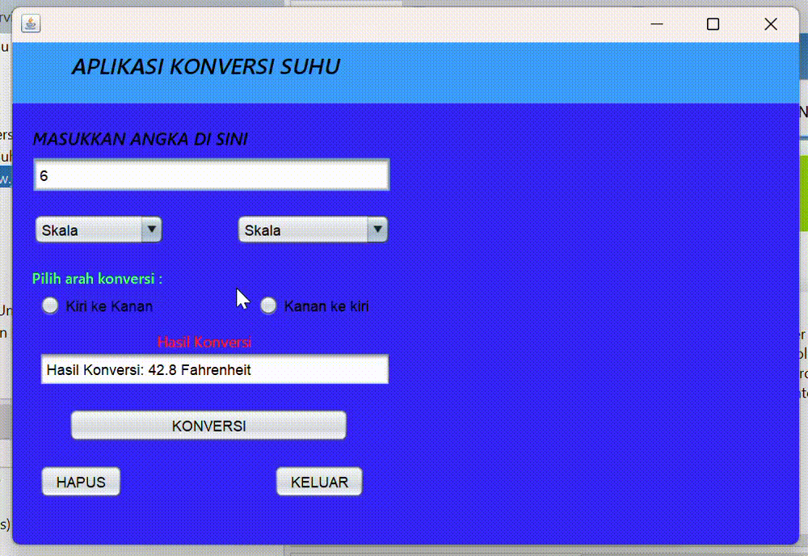

# Aplikasi Konversi Suhu
Latihan 2 - Siti Aisyah Nor Fitriani (2210010043)

## Deskripsi Aplikasi

**Aplikasi Konversi Suhu** adalah aplikasi berbasis Java yang memungkinkan pengguna untuk mengonversi nilai suhu antar skala suhu yang berbeda, seperti Celcius, Fahrenheit, Kelvin, dan Reamur.
Pengguna dapat memilih arah konversi dari satu skala suhu ke skala suhu lainnya.

### Fitur Utama

1. **Konversi Suhu Antar Skala**  
   Mengonversi suhu dari satu skala ke skala lainnya, misalnya dari Celcius ke Fahrenheit, atau dari Kelvin ke Reamur, dan sebaliknya.

2. **Pilihan Arah Konversi**  
   Terdapat dua pilihan arah konversi: dari kiri ke kanan atau dari kanan ke kiri. Pengguna dapat memilih arah konversi sesuai kebutuhan dengan menggunakan radio button.

3. **Validasi Input**  
   Aplikasi melakukan pengecekan dan validasi pada input pengguna untuk memastikan input yang dimasukkan adalah angka. Jika input tidak valid, aplikasi akan menampilkan pesan kesalahan.

4. **Antarmuka Sederhana**  
   Menggunakan Java Swing, aplikasi ini memiliki antarmuka yang mudah dipahami dan digunakan, serta dilengkapi dengan tombol-tombol untuk melakukan konversi, menghapus input, dan keluar dari aplikasi.

### Cara Menggunakan Aplikasi

1. Masukkan nilai suhu pada kotak input yang tersedia.
2. Pilih skala suhu awal dan tujuan pada masing-masing combo box.
3. Tentukan arah konversi dengan memilih salah satu radio button (Kiri ke Kanan atau Kanan ke Kiri).
4. Klik tombol **Konversi** untuk menampilkan hasil konversi pada kotak output.
5. Gunakan tombol **Hapus** untuk membersihkan semua input, atau **Keluar** untuk menutup aplikasi.

### Pembuat Aplikasi
- **Nama**: Siti Aisyah Nor Fitriani  
- **NIM**: 2210010043  
- **Tugas**: Tugas 2

## Demo

---

**Catatan**: Aplikasi ini menggunakan Java Swing untuk antarmuka pengguna dan membutuhkan Java Development Kit (JDK) untuk dijalankan.
